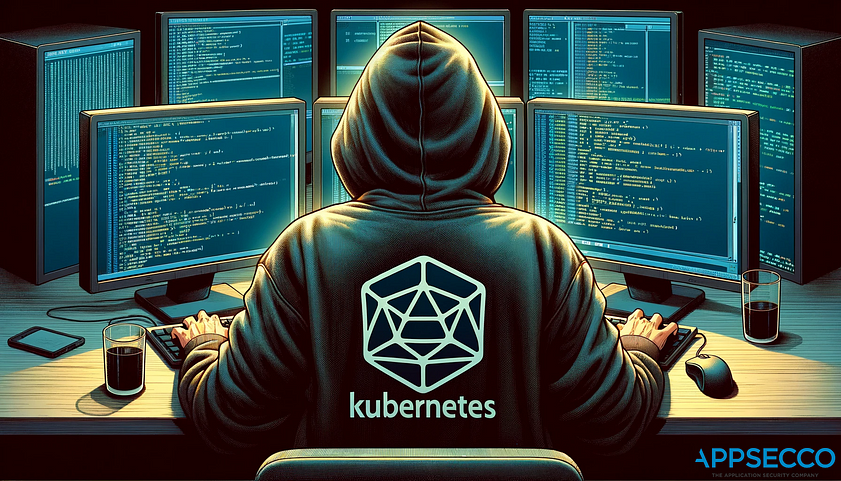
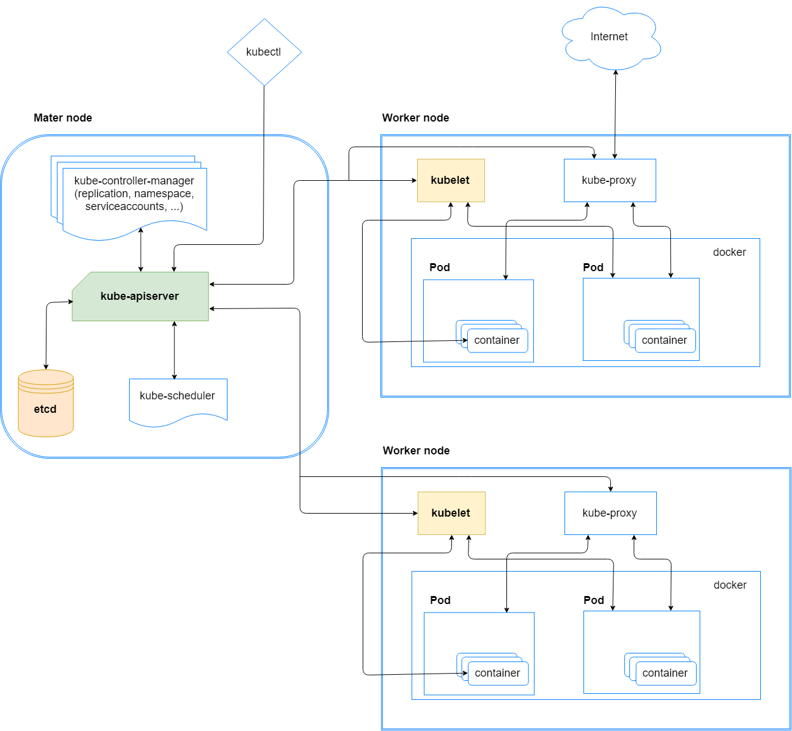
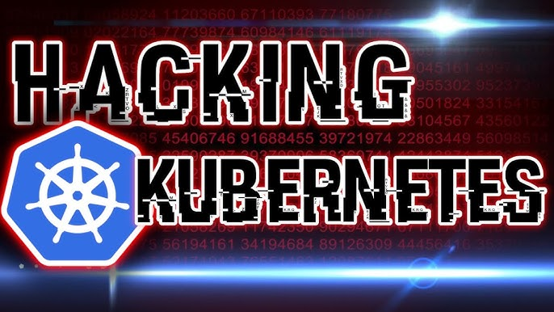

  
  
  
  
  
  
  
  
  

# HackingKubernetes 

HackingKubernetes - is a valuable resource and a leading container management system in development pipelines across 
the world, but it’s not exempt from malicious attacks. Using Kubernetes requires a deep understanding of Kubernetes’ 
environment—including the different vulnerabilities you can be exposed to while creating, deploying, or running 
applications in your clusters.

Since your Kubernetes cluster is likely one of your most valuable cloud resources, it needs to be protected. 
Kubernetes’ security addresses the safety of your cloud, application clusters, containers, apps and code. Although 
Kubernetes provides inherent security advantages, bolstering your defensive tactics is crucial to protecting your 
system against hackers and other cybersecurity threats.    

## Intro
- [OWASP Kubernetes Top Ten](https://owasp.org/www-project-kubernetes-top-ten/)
- [Kubernetes adoption, security, and market trends report](https://www.redhat.com/en/resources/kubernetes-adoption-security-market-trends-overview)

### Official documentation kubernetes
- [Kubernetes Documentation](https://kubernetes.io/docs/home/)
- 

### Intro from TryHackMe (free)
- [Intro to IaC](https://tryhackme.com/r/room/introtoiac)
- [Intro to IaC with answers](https://github.com/BEPb/tryhackme/blob/master/01.easy/Intro%20to%20IaC.md)
- [Microservices Architectures](https://tryhackme.com/r/room/microservicearchitectures)
- [Microservices Architectures with answers](https://github.com/BEPb/tryhackme/blob/master/01.easy/Microservices%20Architectures.md)
- [Kubernetes for Everyone](https://tryhackme.com/r/room/kubernetesforyouly)
- [Kubernetes for Everyone with answers](https://github.com/BEPb/tryhackme/blob/master/02.Medium/Kubernetes%20for%20Everyone.md)
- [K8s Best Security Practices](https://tryhackme.com/r/room/k8sbestsecuritypractices)
- [K8s Best Security Practices with answers](https://github.com/BEPb/tryhackme/blob/master/02.Medium/K8s%20Best%20Security%20Practices.md)
- [Cluster Hardening](https://tryhackme.com/r/room/clusterhardening)
- [Cluster Hardening with answers](https://github.com/BEPb/tryhackme/blob/master/02.Medium/Cluster%20Hardening.md)
- [Frank & Herby make an app](https://tryhackme.com/r/room/frankandherby)
- [Frank & Herby make an app with answers](https://github.com/BEPb/tryhackme/blob/master/02.Medium/Frank%20%26%20Herby%20make%20an%20app.md)

### Intro from vmware
- [What is Kubernetes?](https://www.vmware.com/topics/kubernetes)
- [What is DevSecOps?](https://tanzu.vmware.com/devsecops)
- [What is Kubernetes Architecture?](https://www.vmware.com/topics/kubernetes-architecture)
- [What are Kubernetes Services?](https://www.vmware.com/topics/kubernetes-services)
- [What is Kubernetes Security?](https://www.vmware.com/topics/kubernetes-security)
- [What is Kubernetes Networking?](https://www.vmware.com/topics/kubernetes-networking)
- [What are Kubernetes Clusters vs. Nodes vs. Pods vs. Containers vs. Containerized Applications?](https://www.vmware.com/topics/components-kubernetes)
- [What are Kubernetes Pods?](https://www.vmware.com/topics/kubernetes-pods)

### [A Deep Dive Into Kubernetes Pods](https://blog.yarsalabs.com/a-deep-dive-into-kubernetes-pods/)
- [Installing the Components required for a Kubernetes Cluster](https://blog.yarsalabs.com/kubernetes-cluster-from-scratch-part1/)
- [TLS Certificates Management for a Kubernetes Cluster](https://blog.yarsalabs.com/kubernetes-cluster-from-scratch-part2/)
- [ETCD Server Setup for a Kubernetes Cluster](https://blog.yarsalabs.com/kubernetes-cluster-from-scratch-part3/)
- [Generating Kubernetes Configuration Files for Authentication](https://blog.yarsalabs.com/kubernetes-cluster-from-scratch-part4/)
- [Creating the Kubernetes Control Plane](https://blog.yarsalabs.com/kubernetes-cluster-from-scratch-part5/)

### Atricles How to Hack Kubernetes
- [How to Hack Kubernetes (and How to Protect It)](https://goteleport.com/blog/how-to-hack-kubernetes/)
- [Securing Kubernetes Clusters by Eliminating Risky Permissions](https://www.cyberark.com/resources/threat-research-blog/securing-kubernetes-clusters-by-eliminating-risky-permissions)

- [Kubernetes Pentest Methodology Part 1](https://www.cyberark.com/resources/threat-research-blog/kubernetes-pentest-methodology-part-1)
- [Kubernetes Pentest Methodology Part 2](https://www.cyberark.com/resources/threat-research-blog/kubernetes-pentest-methodology-part-2)
- [Kubernetes Pentest Methodology Part 3](https://www.cyberark.com/resources/threat-research-blog/kubernetes-pentest-methodology-part-3)
- [Eight Ways to Create a Pod](https://www.cyberark.com/resources/threat-research-blog/eight-ways-to-create-a-pod)
- [Unit 42 CTR: Leaked Code from Docker Registries](https://unit42.paloaltonetworks.com/leaked-docker-code/)
- [Kubernetes Pod Escape Using Log Mounts](https://www.aquasec.com/blog/kubernetes-security-pod-escape-log-mounts/)

### PDF
- [Learn by Hacking](https://github.com/BEPb/HackingKubernetes/blob/master/pdf/Learn%20by%20Hacking.pdf)
- [k8s_cheatsheet.md](https://github.com/BEPb/HackingKubernetes/blob/master/pdf/k8s_cheatsheet.md)
- 

### Tools
- [neuvector](https://github.com/neuvector/neuvector)
- [CIS Benchmark](https://www.cisecurity.org/cis-benchmarks)
- [KubiScan](https://github.com/cyberark/KubiScan)
- [kubeletctl](https://github.com/cyberark/kubeletctl)
- [kubernetes-rbac-audit](https://github.com/cyberark/kubernetes-rbac-audit)
- [Kubescape](https://kubescape.io/)
- [checkov](https://github.com/bridgecrewio/checkov)
- [kubesploit](https://github.com/cyberark/kubesploit)
- [kube-hunter](https://github.com/aquasecurity/kube-hunter)
- [kube-bench](https://github.com/aquasecurity/kube-bench)

