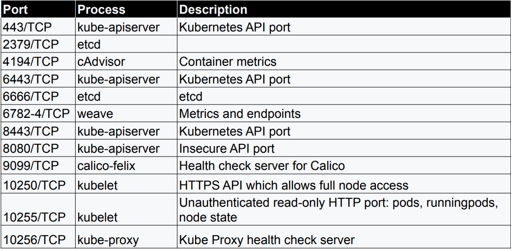

  
  
  
  
  
  
  
  
  

# HackingKubernetes 

HackingKubernetes - is a valuable resource and a leading container management system in development pipelines across 
the world, but it’s not exempt from malicious attacks. Using Kubernetes requires a deep understanding of Kubernetes’ 
environment—including the different vulnerabilities you can be exposed to while creating, deploying, or running 
applications in your clusters.

Since your Kubernetes cluster is likely one of your most valuable cloud resources, it needs to be protected. 
Kubernetes’ security addresses the safety of your cloud, application clusters, containers, apps and code. Although 
Kubernetes provides inherent security advantages, bolstering your defensive tactics is crucial to protecting your 
system against hackers and other cybersecurity threats.    

## Intro
- [OWASP Kubernetes Top Ten](https://owasp.org/www-project-kubernetes-top-ten/)
- [Kubernetes adoption, security, and market trends report](https://www.redhat.com/en/resources/kubernetes-adoption-security-market-trends-overview)

### Official documentation kubernetes
- [Kubernetes Documentation](https://kubernetes.io/docs/home/)
- [Github repo kubernetes](https://github.com/kubernetes/kubernetes/)
- [11 Ways (Not) to Get Hacked](https://kubernetes.io/blog/2018/07/18/11-ways-not-to-get-hacked/)
- [Security kubernetes](https://kubernetes.io/docs/concepts/security/)
- [Docker Engine security](https://docs.docker.com/engine/security/)
- 

### Security resources
- [Container Security Site](https://www.container-security.site/)
- [KubeCon + CloudNativeCon Europe 2024](https://www.youtube.com/playlist?list=PLj6h78yzYM2N8nw1YcqqKveySH6_0VnI0)
- [Cloud native computing foundation](https://www.cncf.io/)

### Intro from TryHackMe (free)
- [Intro to IaC](https://tryhackme.com/r/room/introtoiac)
- [Intro to IaC with answers](https://github.com/BEPb/tryhackme/blob/master/01.easy/Intro%20to%20IaC.md)
- [Microservices Architectures](https://tryhackme.com/r/room/microservicearchitectures)
- [Microservices Architectures with answers](https://github.com/BEPb/tryhackme/blob/master/01.easy/Microservices%20Architectures.md)
- [Kubernetes for Everyone](https://tryhackme.com/r/room/kubernetesforyouly)
- [Kubernetes for Everyone with answers](https://github.com/BEPb/tryhackme/blob/master/02.Medium/Kubernetes%20for%20Everyone.md)
- [K8s Best Security Practices](https://tryhackme.com/r/room/k8sbestsecuritypractices)
- [K8s Best Security Practices with answers](https://github.com/BEPb/tryhackme/blob/master/02.Medium/K8s%20Best%20Security%20Practices.md)
- [Cluster Hardening](https://tryhackme.com/r/room/clusterhardening)
- [Cluster Hardening with answers](https://github.com/BEPb/tryhackme/blob/master/02.Medium/Cluster%20Hardening.md)
- [Frank & Herby make an app](https://tryhackme.com/r/room/frankandherby)
- [Frank & Herby make an app with answers](https://github.com/BEPb/tryhackme/blob/master/02.Medium/Frank%20%26%20Herby%20make%20an%20app.md)

### Intro from vmware
- [What is Kubernetes?](https://www.vmware.com/topics/kubernetes)
- [What is DevSecOps?](https://tanzu.vmware.com/devsecops)
- [What is Kubernetes Architecture?](https://www.vmware.com/topics/kubernetes-architecture)
- [What are Kubernetes Services?](https://www.vmware.com/topics/kubernetes-services)
- [What is Kubernetes Security?](https://www.vmware.com/topics/kubernetes-security)
- [What is Kubernetes Networking?](https://www.vmware.com/topics/kubernetes-networking)
- [What are Kubernetes Clusters vs. Nodes vs. Pods vs. Containers vs. Containerized Applications?](https://www.vmware.com/topics/components-kubernetes)
- [What are Kubernetes Pods?](https://www.vmware.com/topics/kubernetes-pods)

### [A Deep Dive Into Kubernetes Pods](https://blog.yarsalabs.com/a-deep-dive-into-kubernetes-pods/)
- [Installing the Components required for a Kubernetes Cluster](https://blog.yarsalabs.com/kubernetes-cluster-from-scratch-part1/)
- [TLS Certificates Management for a Kubernetes Cluster](https://blog.yarsalabs.com/kubernetes-cluster-from-scratch-part2/)
- [ETCD Server Setup for a Kubernetes Cluster](https://blog.yarsalabs.com/kubernetes-cluster-from-scratch-part3/)
- [Generating Kubernetes Configuration Files for Authentication](https://blog.yarsalabs.com/kubernetes-cluster-from-scratch-part4/)
- [Creating the Kubernetes Control Plane](https://blog.yarsalabs.com/kubernetes-cluster-from-scratch-part5/)

### Cheatsheets

- [quick reference](https://kubernetes.io/docs/reference/kubectl/quick-reference/)
- [k8s_cheatsheet.md](https://github.com/BEPb/HackingKubernetes/blob/master/pdf/k8s_cheatsheet.md)
- [k8s-cheat-sheet](https://encore.dev/resources/k8s-cheat-sheet)
- [kubernetes-cheat-sheet](https://www.mirantis.com/blog/kubernetes-cheat-sheet)

### Atricles How to Hack Kubernetes
- [How to Hack Kubernetes (and How to Protect It)](https://goteleport.com/blog/how-to-hack-kubernetes/)
- [Securing Kubernetes Clusters by Eliminating Risky Permissions](https://www.cyberark.com/resources/threat-research-blog/securing-kubernetes-clusters-by-eliminating-risky-permissions)
- [Kubernetes Pentest Methodology Part 1](https://www.cyberark.com/resources/threat-research-blog/kubernetes-pentest-methodology-part-1)
- [Kubernetes Pentest Methodology Part 2](https://www.cyberark.com/resources/threat-research-blog/kubernetes-pentest-methodology-part-2)
- [Kubernetes Pentest Methodology Part 3](https://www.cyberark.com/resources/threat-research-blog/kubernetes-pentest-methodology-part-3)
- [Eight Ways to Create a Pod](https://www.cyberark.com/resources/threat-research-blog/eight-ways-to-create-a-pod)
- [Kubernetes Pod Escape Using Log Mounts](https://www.aquasec.com/blog/kubernetes-security-pod-escape-log-mounts/)
- [The Route to Root: Container Escape Using Kernel Exploitation](https://www.cyberark.com/resources/threat-research-blog/the-route-to-root-container-escape-using-kernel-exploitation)
- [Attacking Kubernetes clusters using the Kubelet API](https://faun.pub/attacking-kubernetes-clusters-using-the-kubelet-api-abafc36126ca)
- [Threat matrix for Kubernetes](https://www.microsoft.com/en-us/security/blog/2020/04/02/attack-matrix-kubernetes/)
- [Secure containerized environments with updated threat matrix for Kubernetes](https://www.microsoft.com/en-us/security/blog/2021/03/23/secure-containerized-environments-with-updated-threat-matrix-for-kubernetes/)
- [Introduction to GKE Kubelet TLS Bootstrap Privilege Escalation](https://rhinosecuritylabs.com/cloud-security/kubelet-tls-bootstrap-privilege-escalation/)
- [Bad Pods: Kubernetes Pod Privilege Escalation](https://bishopfox.com/blog/kubernetes-pod-privilege-escalation)
- [Bad Pods github](https://github.com/BishopFox/badPods)

### PDF
- [Learn by Hacking](https://github.com/calinah/learn-by-hacking-kccn/blob/master/Learn%20by%20Hacking.pdf)
- 
- 

<main>  <h1 id="container--kubernetes-security-tools"> <a href="#container--kubernetes-security-tools" class="anchor-heading" aria-labelledby="container--kubernetes-security-tools"><svg viewBox="0 0 16 16" aria-hidden="true"><use xlink:href="#svg-link"></use></svg></a> Container &amp; Kubernetes Security Tools </h1>
This is a list of open source tools which help with areas related to Container security. Some of the tools in this list don’t fit neatly into a specific category or categories, so they’re listed with the closest option.
 <h2 id="container-attack-surface-assessment--breakout-tools"> <a href="#container-attack-surface-assessment--breakout-tools" class="anchor-heading" aria-labelledby="container-attack-surface-assessment--breakout-tools"><svg viewBox="0 0 16 16" aria-hidden="true"><use xlink:href="#svg-link"></use></svg></a> Container Attack Surface Assessment &amp; Breakout Tools </h2> 
Useful tools to run inside a container to assess the sandbox that’s in use, and exploit some common breakout issues.
 <ul> <li><a href="https://github.com/stealthcopter/deepce">deepce</a> - Docker Enumeration, Escalation of Privileges and Container Escapes</li> <li><a href="https://github.com/cdk-team/CDK">CDK</a> - Container and Kubernetes auditing and breakout tool.</li> </ul> <h2 id="container-vulnerability-scanning-tools"> <a href="#container-vulnerability-scanning-tools" class="anchor-heading" aria-labelledby="container-vulnerability-scanning-tools"><svg viewBox="0 0 16 16" aria-hidden="true"><use xlink:href="#svg-link"></use></svg></a> Container Vulnerability Scanning Tools </h2> <ul> <li><a href="https://github.com/aquasecurity/trivy">Trivy</a> - Vulnerability and IaC scanner</li> <li><a href="https://github.com/anchore/grype">Grype</a> - Container vulnerability scanner</li> <li><a href="https://github.com/quay/clair">clair</a> - Container vulnerability scanner</li> <li><a href="https://docs.docker.com/scout/">Docker Scout</a> - Container Vulnerability scanner</li> <li><a href="https://github.com/AppThreat/dep-scan">dep-scan</a> - Vulnerability and mis-configuration scanner</li> <li><a href="https://github.com/neuvector/scanner">Neuvector Scanner</a> - Container Vulnerability Scanning Tool.</li> </ul> <h2 id="iac-scanning-tools-that-cover-container-formats"> <a href="#iac-scanning-tools-that-cover-container-formats" class="anchor-heading" aria-labelledby="iac-scanning-tools-that-cover-container-formats"><svg viewBox="0 0 16 16" aria-hidden="true"><use xlink:href="#svg-link"></use></svg></a> IaC Scanning Tools that cover container formats </h2> <ul> <li><a href="https://github.com/aquasecurity/trivy">Trivy</a> - Vulnerability and IaC scanner</li> <li><a href="https://github.com/bridgecrewio/checkov">Checkov</a> - IaC scanner</li> <li><a href="https://github.com/Checkmarx/kics">KICS</a> - IaC scanner</li> <li><a href="https://github.com/AppThreat/dep-scan">dep-scan</a> - Vulnerability and mis-configuration scanner</li> <li><a href="https://github.com/tenable/terrascan">Terrascan</a> - IAC Scanner for various formats including Docker and Kubernetes</li> <li><a href="https://github.com/hadolint/hadolint">hadolint</a> - Docker file linter</li> </ul> <h2 id="docker-security-tools"> <a href="#docker-security-tools" class="anchor-heading" aria-labelledby="docker-security-tools"><svg viewBox="0 0 16 16" aria-hidden="true"><use xlink:href="#svg-link"></use></svg></a> Docker Security Tools </h2> <ul> <li><a href="https://github.com/docker/docker-bench-security">docker bench</a> - Docker CIS Benchmark assessment tool</li> <li><a href="https://github.com/goodwithtech/dockle">Dockle</a> - Container Image Linter</li> <li><a href="https://github.com/mondoohq/cnspec">cnspec</a> - Assessment tool for multiple platforms including Docker and Kubernetes</li> </ul> <h2 id="container-runtime-security-tools"> <a href="#container-runtime-security-tools" class="anchor-heading" aria-labelledby="container-runtime-security-tools"><svg viewBox="0 0 16 16" aria-hidden="true"><use xlink:href="#svg-link"></use></svg></a> Container Runtime Security Tools </h2> <ul> <li><a href="https://github.com/aquasecurity/tracee">Tracee</a>. Container runtime security tooling</li> <li><a href="https://github.com/falcosecurity/falco">Falco</a>. Container runtime security tooling</li> <li><a href="https://github.com/kubearmor/KubeArmor">Kubearmor</a>. Container runtime security enforcement tool</li> <li><a href="https://github.com/cilium/tetragon">Tetragon</a>. Container runtime security tool</li> </ul> <h2 id="container-registry-tools"> <a href="#container-registry-tools" class="anchor-heading" aria-labelledby="container-registry-tools"><svg viewBox="0 0 16 16" aria-hidden="true"><use xlink:href="#svg-link"></use></svg></a> Container Registry Tools </h2> <ul> <li><a href="https://github.com/regclient/regclient">regclient</a> - Another tool for interacting with container registries</li> <li><a href="https://github.com/google/go-containerregistry">crane</a> - Tool for interacting with Container registries.</li> <li><a href="https://github.com/containers/skopeo">skopeo</a> - Tool for interaction with Container registries</li> </ul> <h2 id="container-image-tools"> <a href="#container-image-tools" class="anchor-heading" aria-labelledby="container-image-tools"><svg viewBox="0 0 16 16" aria-hidden="true"><use xlink:href="#svg-link"></use></svg></a> Container Image Tools </h2> <ul> <li><a href="https://github.com/wagoodman/dive">Dive</a> - Tool for exploring Container image layers</li> </ul> <h2 id="kubernetes-tools"> <a href="#kubernetes-tools" class="anchor-heading" aria-labelledby="kubernetes-tools"><svg viewBox="0 0 16 16" aria-hidden="true"><use xlink:href="#svg-link"></use></svg></a> Kubernetes Tools </h2> <h3 id="rbac-assessment-tools"> <a href="#rbac-assessment-tools" class="anchor-heading" aria-labelledby="rbac-assessment-tools"><svg viewBox="0 0 16 16" aria-hidden="true"><use xlink:href="#svg-link"></use></svg></a> RBAC Assessment Tools </h3> <ul> <li><a href="https://github.com/alcideio/rbac-tool">rbac-tool</a> - RBAC Tool for Kubernetes</li> <li><a href="https://github.com/cyberark/KubiScan">kubiScan</a> - Tool to scan Kubernetes clusters for risky permissions</li> <li><a href="https://github.com/appvia/krane">krane</a> - Kubernetes RBAC static analysis &amp; visualisation tool</li> <li><a href="https://github.com/raesene/eathar">eathar</a> - Kubernetes security assessment tool focusing on workload security and RBAC.</li> </ul> <h3 id="kubernetes-security-auditing-tools"> <a href="#kubernetes-security-auditing-tools" class="anchor-heading" aria-labelledby="kubernetes-security-auditing-tools"><svg viewBox="0 0 16 16" aria-hidden="true"><use xlink:href="#svg-link"></use></svg></a> Kubernetes Security Auditing Tools </h3> <ul> <li><a href="https://github.com/aquasecurity/kube-bench">kube-bench</a> - Tool to assess compliance with the CIS benchmark for various Kubernetes distributions</li> <li><a href="https://github.com/armosec/kubescape">kubescape</a> - Kubernetes security assessment tool</li> <li><a href="https://github.com/Shopify/kubeaudit">kubeaudit</a> - Kubernetes security assessment tool focusing on workload security</li> <li><a href="https://github.com/controlplaneio/kubesec">kubesec</a> - Kubernetes security assessment tool focusing on workload security</li> <li><a href="https://github.com/zegl/kube-score">kubescore</a> - Kubernetes security and reliability assessment tool focusing on workload security.</li> <li><a href="https://github.com/raesene/eathar">eathar</a> - Kubernetes security assessment tool focusing on workload security and RBAC.</li> <li><a href="https://github.com/derailed/popeye">popeye</a> - Kubernetes cluster scanner, looking for possible mis-configurations.</li> <li><a href="https://github.com/mondoohq/cnspec">cnspec</a> - Assessment tool for multiple platforms including Docker and Kubernetes</li> </ul> <h3 id="kubernetes-penetration-testing-tools"> <a href="#kubernetes-penetration-testing-tools" class="anchor-heading" aria-labelledby="kubernetes-penetration-testing-tools"><svg viewBox="0 0 16 16" aria-hidden="true"><use xlink:href="#svg-link"></use></svg></a> Kubernetes Penetration Testing Tools </h3> <ul> <li><a href="https://github.com/inguardians/peirates">peirates</a> - Kubernetes container breakout tool</li> <li><a href="https://github.com/quarkslab/kdigger">kdigger</a> - Kubernetes breakout/discovery tool</li> <li><a href="https://github.com/raesene/teisteanas">teisteanas</a> - Tool to create kubeconfig files based on the CertificateSigningRequest API.</li> <li><a href="https://github.com/raesene/tocan">tòcan</a> - Tool to create kubeconfig files based on the TokenRequest API.</li> <li><a href="https://github.com/DataDog/managed-kubernetes-auditing-toolkit/">MKAT</a> - Managed Kubernetes Auditing Tool. Focuses on exploring security issues in managed Kubernetes (e.g. EKS)</li> <li><a href="https://kubehound.io/">Kubehound</a> - KubeHound creates a graph of attack paths in a Kubernetes cluster</li> <li><a href="https://github.com/WithSecureLabs/IceKube">IceKube</a> - Kubernetes attack path evaluation tool.</li> <li><a href="https://github.com/wiz-sec-public/namespacehound/">namespacehound</a> - Tool to test a cluster for possible namespace breakouts where multi-tenancy is in use.</li> </ul> <h3 id="kubelet-tools"> <a href="#kubelet-tools" class="anchor-heading" aria-labelledby="kubelet-tools"><svg viewBox="0 0 16 16" aria-hidden="true"><use xlink:href="#svg-link"></use></svg></a> Kubelet Tools </h3> <ul> <li><a href="https://github.com/cyberark/kubeletctl">kubeletctl</a> - This is a good tool to automate the process of assessing a kubelet instance. If the instance is vulnerable it can also carry out some exploit tasks</li> <li><a href="https://github.com/raesene/kubelet_dumper">kubelet dumper</a> - PoC tool to dump Kubelet configurations for review.</li> </ul> <h3 id="etcd-tools"> <a href="#etcd-tools" class="anchor-heading" aria-labelledby="etcd-tools"><svg viewBox="0 0 16 16" aria-hidden="true"><use xlink:href="#svg-link"></use></svg></a> etcd Tools </h3> <ul> <li><a href="https://github.com/jpbetz/auger">auger</a> - Tool for decoding information pulled directly from the etcd database</li> </ul> <h3 id="security-observability-tools"> <a href="#security-observability-tools" class="anchor-heading" aria-labelledby="security-observability-tools"><svg viewBox="0 0 16 16" aria-hidden="true"><use xlink:href="#svg-link"></use></svg></a> Security Observability Tools </h3> <ul> <li><a href="https://github.com/deepfence/ThreatMapper">ThreatMapper</a>. Cloud + Container Security observability</li> </ul> <h3 id="training-tools"> <a href="#training-tools" class="anchor-heading" aria-labelledby="training-tools"><svg viewBox="0 0 16 16" aria-hidden="true"><use xlink:href="#svg-link"></use></svg></a> Training Tools </h3> 
If you’re looking to practice with some of the tools here, in a safe environment, there are projects to help with that.
 <ul> <li><a href="https://github.com/raesene/kube_security_lab">Kube Security Lab</a> - Basic set of Kubernetes security scenarios implemented in Ansible with KinD</li> <li><a href="https://github.com/kubernetes-simulator/simulator">Kubernetes Simulator</a> - AWS based Kubernetes cluster environment with different vulnerability scenarios</li> <li><a href="https://github.com/madhuakula/kubernetes-goat">Kubernetes Goat</a> - Focuses on vulnerable deployments on top of an existing cluster. Also available on line <a href="https://katacoda.com/madhuakula/scenarios/kubernetes-goat">with Katacoda</a></li> <li><a href="https://github.com/TremoloSecurity/k8s-idm-lab">K8s-iam-lab</a> - Kubernetes IAM Lab</li> </ul> <h3 id="kubernetes-honeypot-projects"> <a href="#kubernetes-honeypot-projects" class="anchor-heading" aria-labelledby="kubernetes-honeypot-projects"><svg viewBox="0 0 16 16" aria-hidden="true"><use xlink:href="#svg-link"></use></svg></a> Kubernetes Honeypot projects </h3> <ul> <li><a href="https://github.com/Zeerg/helix-honeypot">Helix Honeypot</a> - Kubernetes API server honeypot</li> <li><a href="https://blog.thinkst.com/2021/11/a-kubeconfig-canarytoken.html">Kubernetes Honeytokens</a> - A honey token Canary for use with honeypots.</li> </ul> <h3 id="kubernetes-security-improvement-tools"> <a href="#kubernetes-security-improvement-tools" class="anchor-heading" aria-labelledby="kubernetes-security-improvement-tools"><svg viewBox="0 0 16 16" aria-hidden="true"><use xlink:href="#svg-link"></use></svg></a> Kubernetes Security Improvement Tools </h3> <ul> <li><a href="https://github.com/kubernetes-sigs/security-profiles-operator">Security Profiles Operator</a> - Kubernetes operator for security profiles</li> <li><a href="https://github.com/aws-samples/hardeneks">hardeneks</a> - Tool to harden EKS clusters</li> </ul> <h1 id="deprecatedunmaintained-tools"> <a href="#deprecatedunmaintained-tools" class="anchor-heading" aria-labelledby="deprecatedunmaintained-tools"><svg viewBox="0 0 16 16" aria-hidden="true"><use xlink:href="#svg-link"></use></svg></a> Deprecated/Unmaintained Tools </h1> 
Inevitably over time, some tools will become unmaintained and deprecated. Whilst they may still work ok, caution is needed. If I’ve listed you here and you’re not deprecated just open an issue to move it back :)
 <ul> <li><a href="https://github.com/aquasecurity/kube-hunter">kube-hunter</a> - Tool to test and exploit standard Kubernetes Security Vulnerabilities</li> <li><a href="https://github.com/aquasecurity/kubectl-who-can">kubectl-who-can</a> - Tool that lets you ask “who can” do things in RBAC, e.g. who can get secrets</li> <li><a href="https://github.com/corneliusweig/rakkess">rakkess</a> - Shows the RBAC permissions available to a user as a list</li> <li><a href="https://github.com/team-soteria/rback">rback</a> - tool for graphical representation of RBAC permissions in a kubernetes cluster</li> <li><a href="https://github.com/genuinetools/amicontained">amicontained</a> - will show you information about the container runtime and rights you have</li> <li><a href="https://github.com/nccgroup/ConMachi/">ConMachi</a> - Pentester focused container attack surface assessment tool</li> <li><a href="https://github.com/brompwnie/botb">botb</a> - Container breakout assessment tool. Can automatically exploit common issues like the Docker socket mount</li> <li><a href="https://github.com/antitree/keyctl-unmask">keyctl-unmask</a> - Tool that specifically focuses on grabbing kernel keyring entries from containers that allow the keyctl syscall</li> <li><a href="https://github.com/nccgroup/go-pillage-registries">go-pillage-registries</a> - Tool to search the manifests and configuration for images in a registry for potentially sensitive information</li> <li><a href="https://github.com/genuinetools/reg">reg</a> - Tool for interacting with Container registries</li> <li><a href="https://github.com/P3GLEG/Whaler">Whaler</a> - Tool to reverse Docker images into Dockerfiles.</li> <li><a href="https://github.com/PaloAltoNetworks/rbac-police">RBAC Police</a> - RBAC policy evaluation.</li> <li><a href="https://github.com/vchinnipilli/kubestrike">kubestrike</a> - Security auditing tool for Kubernetes looks at Authenticated and unauthenticated scanning</li> <li><a href="https://github.com/Rolix44/Kubestroyer">kubestroyer</a> - Kubernetes pentesting tool.</li> <li><a href="https://github.com/redhuntlabs/kubestalk">kubestalk</a> - Black Box Kubernetes Pentesting Tool.</li> <li><a href="https://github.com/yasindce1998/KubeDagger">kubedagger</a> - Kubernetes offensive framework built in eBPF.</li> <li><a href="https://github.com/cyberark/kubesploit">kubesploit</a> - Kubesploit is a cross-platform post-exploitation HTTP/2 Command &amp; Control server and agent written in Golang, focused on containerized environments</li> <li><a href="https://github.com/Maddosaurus/k8spot">k8spot</a> - Kubernetes honeypot.</li> </ul> </main>

